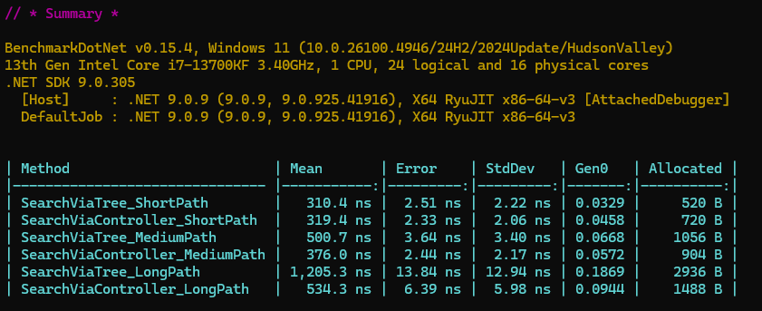

# EffectiveMobileTestTask

## Описание

Этот проект реализует **поиск компаний по регионам**, представленным в виде иерархических путей, например: 

`/ru/msk`, `/ru/svrd/revda`.

Проект использует **дерево регионов** и **индексированный словарь** для быстрого поиска. Также реализована возможность **полной замены списка компаний** и **перестройка индекса**.

---
## Бенчмарк

Было 2 варианта решения - через дерево нод или контроллер-словарь. 

Для сравнения производительности двух методов поиска используется **BenchmarkDotNet**.



---

## API документация

[https://localhost:5001/scalar/v1](https://localhost:5001/scalar/v1)

## Эндпоинты

### GET `/find-companies`

- **Описание**: Возвращает список компаний, связанных с указанным регионом и его подрегионами.
- **Параметры**:
  - `path` (query) — путь региона, например, `/ru/msk`.
- **Пример**:
  ```
  GET /find-companies?path=/ru
  ```
- **Ответ**:
  ```
  200 OK
  [
  {
    "name": "Яндекс.Директ",
    "paths": [
      "/ru"
    ]
  }
  ]
  ```

---


### POST `/replace-companies`

- **Описание**: Полностью заменяет список компаний и перестраивает дерево и индекс.
- **Тело запроса**:
  ```json
  [
    {
      "Name": "Новая компания",
      "Paths": ["/ru/msk", "/ru/spb"]
    }
  ]
  ```
- **Ответ**:
  ```
  200 OK
  "Companies replaced successfully."
  ```

---

## Тестовые данные для `/replace-companies` (необязательно, данные сидируются на старте приложения)

Для замены списка компаний можно использовать следующий JSON:

```json
[
  {
    "Name": "Яндекс.Директ",
    "Paths": ["/ru"]
  },
  {
    "Name": "Ревдинский рабочий",
    "Paths": ["/ru/svrd/revda", "/ru/svrd/pervik"]
  },
  {
    "Name": "Газета уральских москвичей",
    "Paths": ["/ru/msk", "/ru/permobl", "/ru/chelobl"]
  },
  {
    "Name": "Крутая реклама",
    "Paths": ["/ru/svrd"]
  }
]
```

Отправьте его в теле POST-запроса на `/replace-companies`.
